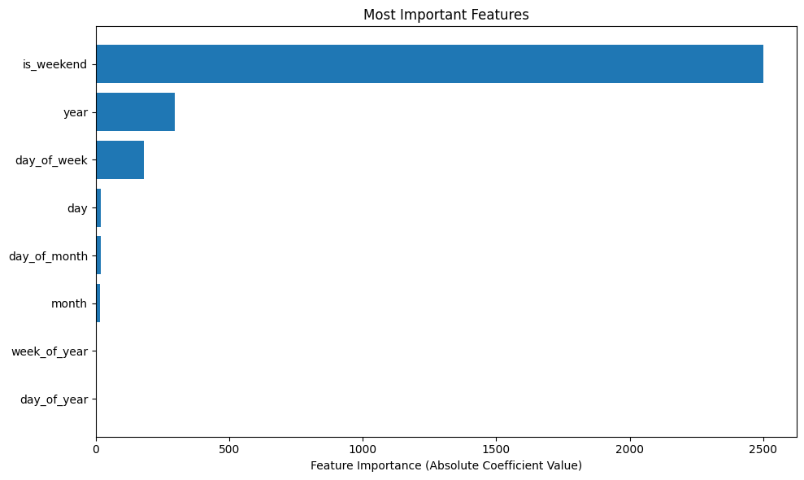

# 📊 Sales Forecast Project (Regression Models)

This project demonstrates how to build and evaluate different **machine learning regression models** for sales prediction using Python.

It includes data preprocessing, feature engineering, exploratory analysis, training multiple models, and comparing their performance.

The following models are implemented:

- Linear Regression
- Decision Tree Regressor
- Random Forest Regressor
- XGBoost Regressor
- Support Vector Regressor (SVR)

---

## 🚀 Project Structure

├── sales.csv            # Example sales dataset (semicolon-separated)    
├── forecast_sales_regression.ipynb # Jupyter Notebook with full workflow  
├── requirements.txt     # Python dependencies  
└── README.md            # Project documentation

---

## ⚙️ Setup Instructions

### 1. Clone the repository
```powershell
git clone <your-repo-url>
cd <project-folder>
```

### 2. Open Jupyter Notebook
```powershell
jupyter notebook forecast_sales_regression.ipynb
```

### 3. Install Requirements (if necessary)
```powershell
pip install -r requirements.txt
```

---

## 📊 Data

The dataset (sales.csv) should contain at least the following columns:

- Posting Date → renamed to date
- plant → plant identifier (e.g., loc30)
- material → product/material code
- quantity → sales quantity

The preprocessing step includes:

- Converting date formats
- Normalizing numeric fields
- Removing negative and zero quantities (business rule)
- Resampling to daily frequency and filling missing dates with 0

---

## 🔮 Forecasting Models

The notebook implements and compares five regression models:

- Linear Regression
- Decision Tree Regressor
- Random Forest Regressor
- XGBoost Regressor
- Support Vector Regressor (SVR)

Each model is trained, tested, and evaluated on the same dataset split.

---

## 📈 Evaluation

The models are evaluated using the following metrics:
- MSE (Mean Squared Error)
- MAE (Mean Absolute Error)
- R² (Coefficient of Determination)

--- 

✅ Example Output

At the end of the notebook, you will see:

Line plots comparing forecasts with actual sales.


A metrics summary table like:

| Model                     | MSE           | MAE       | R²     |
|---------------------------|---------------|-----------|--------|
| Linear Regression         | 3059953.0939  | 1124.4175 | 0.4442 |
| Decision Tree Regressor   | 3234283.8671  | 1074.2428 | 0.4125 |
| Random Forest Regressor   | 4590896.6149  | 1359.8603 | 0.1661 |
| XGBoost Regressor         | 3536599.8713  | 1134.5162 | 0.3576 |
| SVR                       | 5468991.3961  | 1897.4151 | 0.0066 |

Bar plots comparing most important features.



---

## 🎯 Conclusion

**Tree-based models** (Random Forest, XGBoost) typically achieve better accuracy by capturing non-linear patterns.

**Linear Regression** provides interpretability through feature coefficients.

**SVR** can model complex patterns but may require fine-tuning for large datasets.

This comparison highlights the trade-off between accuracy, interpretability, and complexity when choosing models for sales forecasting.

---

## 💻 Requirements

Main dependencies (installed via requirements.txt):

- pandas
- numpy
- matplotlib
- seaborn
- scikit-learn
- xgboost
- jupyter

---
👤 Author: Marco Rocha

📅 Python Version: 3.11.9
